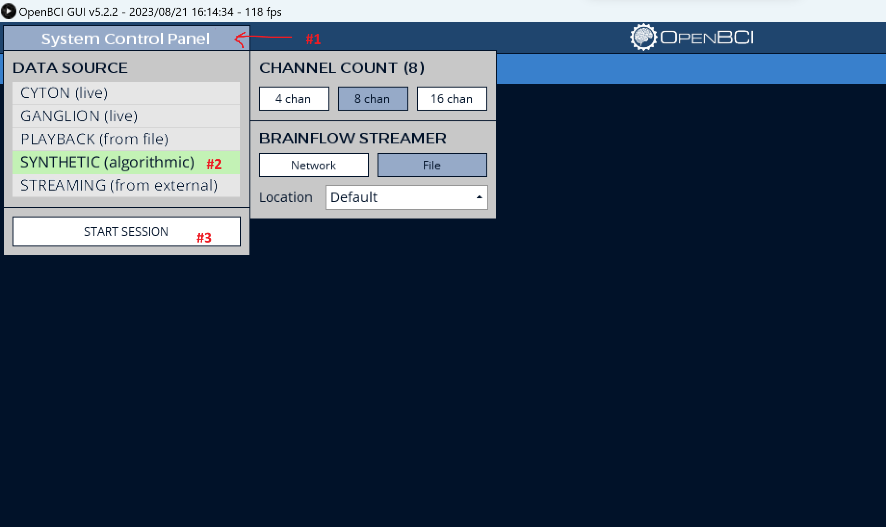
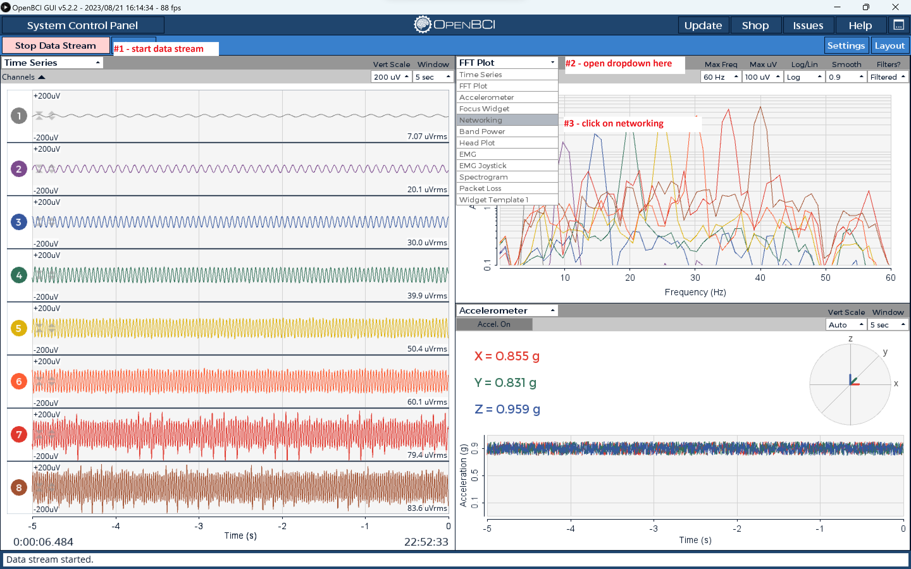
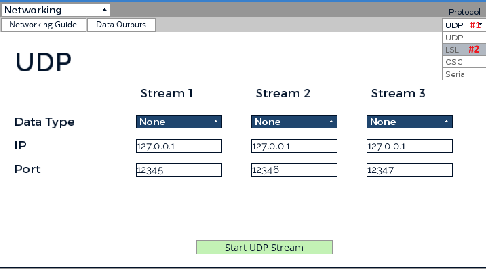
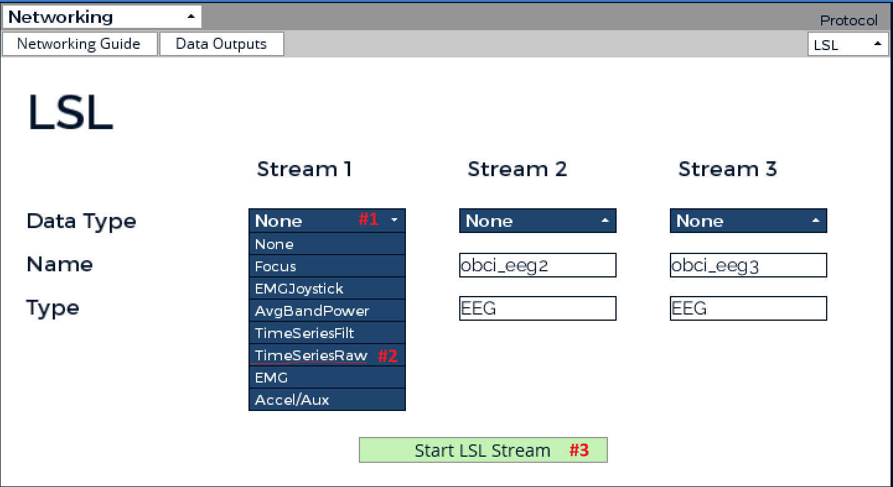

# Data collection platform

The following will guide you on how to run the data collection platform or CLI.

## Dependencies:

Prerequisites:

- Clone 2024 folder to vscode or IDE of choice
- Conda installed on your system (https://docs.anaconda.com/free/miniconda/)
- Pandas installed (within conda) 'pip install pandas'
- The OpenBCI Gui installed (https://openbci.com/downloads)
- Pylsl pip installed
- Pygame pip installed

If on linux, do `conda env create -f environment.yml`, which will create a conda environment called `neurotech` with all the necessary dependencies installed. TODO-create working environment.yml files for mac and windows

## OpenBCI GUI setup

The goal of this section is to funnel the data collected by a BCI board into 8-channel EEG LSL output stream that can be processed by the CLI and other python files. Note that if you just want to mock an 8-channel EEG LSL output stream, you can use the command `liesl mock --type EEG` to do so instead of using a synthetic OpenBCI Board with the OpenBCI GUI.

To set up the OpenBCI GUI with a physical or synthetic board, first start the OpenBCI GUI. Then:

1. Set up an 8-channel synthetic board for testing. Skip this step if you are using a physical board, follow the instructions on how to setup that board instead:
   

2. Open the networking tab (under the drop down time series menu):
   

3. Set the output protocol to LSL:
   

4. Set the data type to TimeSeriesRaw:
   


# Running the data collection platform

First, make sure to activate the correct conda environment with `conda activate neurotech`

Then, while the LSL and OpenBCI Streams have started, run `python main.py` (from the data_collection_platform folder). You should be greeted by the data collection dashboard: 

Hit enter to start the timer. After 5 seconds of rest the dahsboard will alternate through Left, Right and Go commands for 10 seconds with a 20 second rest between each command. This cycle will run for 5 minutes before ending on rest.  

A collected_data directory will be automatically created after the first time you run the data collection platform; raw data is stored in .csv files.

## Running the cli
-for synthetic testing only-

First, make sure to activate the correct conda environment with `conda activate neurotech`

Then, while the LSL Stream from the OpenBCI is started, run `python cli.py` (from the data_collection_platform folder).
Then, connect to the OpenBCI stream and marker stream with option (4). In the `logs/test.log` file in your IDE you should see the following:

```
2024-02-16 20:39:51,151 csv_data_recorder INFO Looking for an EEG stream...
2024-02-16 20:39:55,752 csv_data_recorder INFO Connected to stream: obci_eeg1, Stream channel_count: 8
2024-02-16 20:39:55,752 csv_data_recorder INFO Looking for a marker stream...
2024-02-16 20:39:55,753 csv_data_recorder INFO Found 1 streams
2024-02-16 20:39:55,753 csv_data_recorder INFO Connected to stream: Neurotech markers
```

Then you should be able to start and stop recording with options (2) and (3) respectively.
Use option (1) to send one of the four cross, beep, left, and right markers.

If a connection to the LSL EEG stream is lost, reconnecting the stream should automatically allow data collection to continue.

